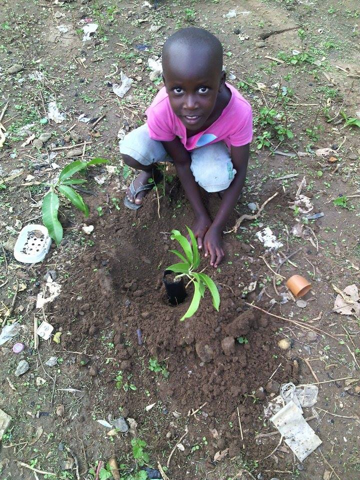

## Married, with Trees
When Ian and I decided to marry in the spring of 2019, we realized that we would be combining two households and definitely did not need wedding gifts. We decided to make tree planting a part of our celebration. We asked our guests to donate toward planting food trees in Uganda and nut trees at [O.U.R. Ecovillage](https://ourecovillage.org/) near Shawnigan Lake, BC.

We held two weddings so that family and friends would not have to drive miles back and forth across BC emitting carbon dioxide all the way. Our first wedding was at my church, St. Saviour’s Pro-Cathedral, in Nelson on June 29th. Our local guests contributed food for a potluck reception, while our out of town guests contributed to trees for Uganda. Our second wedding was an outdoor wedding held at O.U.R. Ecovillage on July 7th. Our guest's donations purchased eight nut trees that will help the village increase its food security. After the wedding ceremony, we planted a sweet chestnut tree to commemorate our wedding.

When all our gifts were received, we were able to send CAN$ 2,100 to Ian’s friend, Moses in the districts of Teso and Karamoja in Uganda. Moses is the founder of [Young Leaders Organization Uganda](https://www.youngleadersuganda.org). Moses organized tree planting at 90 schools and in 10 communities throughout his region. He reported the our gifts covered half the costs of his project, which planted: 200 moringa trees, 5,500 mango trees, 6,000 tamarind trees, 4,000 avocado trees, and 3,000 lemon trees!

## Plant Your Own Trees

Some words about how this turned into this website!
