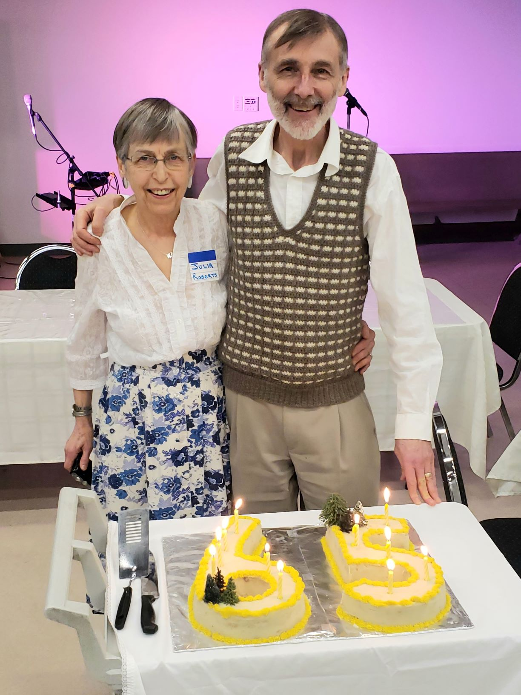

## Ian's 65th Birthday Trees

At Ian's 65th birthday party in February 29, 2020, Many guests generously gifted him with $420 for buying trees to plant this fall.  Kalie Gossen and her daughter, Sage, contributed four 1-gallon fir trees.  Then recently, Scot Merriman dropped off two more fir trees and a large bag of fir cones.

Julia experienced considerable frustration in trying to find a place to plant these native trees.  Fear from COVID seems to have contributed to her ability to make plans with the city. It seemed impossible, so we decided to contribute to the Food Forest that Michael Geselbracht is planting near Bayview Elementary School (Needham Street and View Street).  We have ordered ten fruit trees from Dinter Nursery near Duncan.  They will arrive in February and we will invite you to a tree-planting party then.

Meanwhile, we discovered that the City of Nanaimo has an Urban Forestry Coordinator, Patrick McIntosh.  He arranged for us to plant the six fir trees on the banks of the Millstone River near the Curling Club.  Scot kindly came to help us plant those six fir trees.

